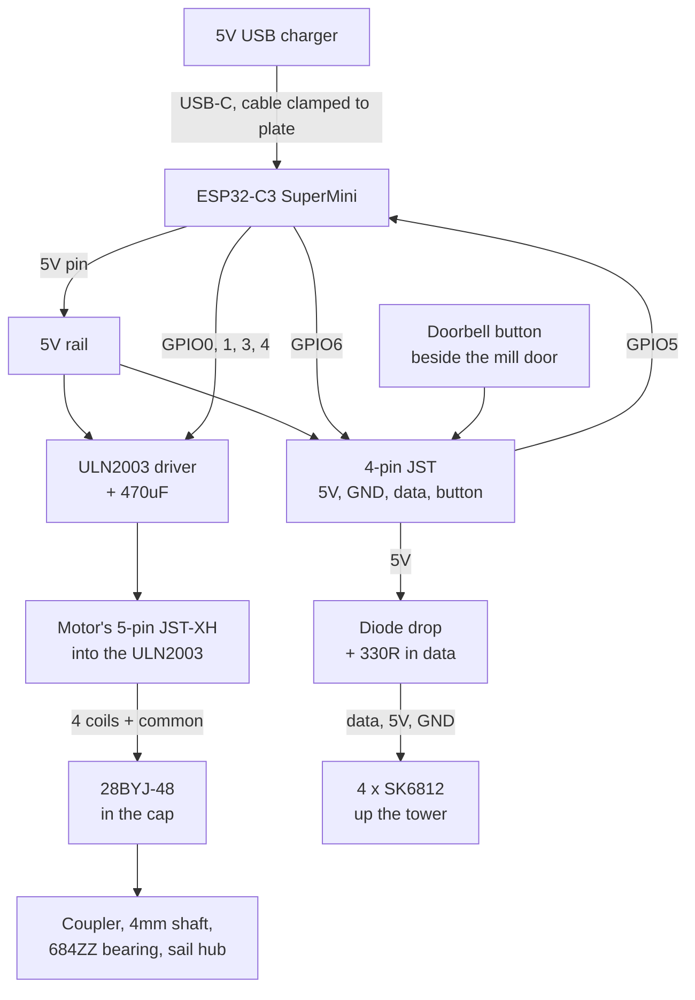

# Windmill Module — Standalone Build Spec

Sep 22, 2026 · @Peter Turner

Matchmaker MM02 windmill, motorised sails and four addressable pixels, on its own ESP node. Built and finished as a self-contained module that later either folds into the main hub or stays an independent node.

## Scope and the migration rule

This module is the mill, its sails, its drive, four pixels and its own ESP, finished and working on the bench before the landscape exists. It has one input: **5V USB into the C3's own USB-C port**, from a USB charger. Nothing else crosses its boundary.

That single rule is what makes both your migration paths work later:

| Path | What changes | What doesn't |
| --- | --- | --- |
| Keep the ESP | Plug its USB cable into any 5V USB source, or a 12V-to-USB module if a 12V bus ever exists | Everything inside the mill |
| Fold it into the main hub | Lift the mill, unplug its two connectors, run 9 wires to the hub | The mill, the drive, the pixels, the mounting |

So the module is built around an internal split at the base of the mill. Above the split: the mill, sails, motor and pixel string, terminating in **two connectors** (decided 2026-10-03): the motor's own **5-pin JST-XH**, extended down the tower, which plugs straight into the ULN2003 board; and a **4-pin JST** carrying 5V, GND, pixel data and the doorbell button. The two have different pin counts, so they cannot be swapped. Below the split, on an electronics plate fixed to the mounting pad inside the mill's ground floor: the ESP and the ULN2003. The mill sits down over the plate and lifts off it, so everything below the split stays serviceable without a base box (decided 2026-10-03).

When the mill joins the main system you either leave the plate alone and change what feeds the USB cable, or you pull the ESP and extend those two connectors to the hub. Neither touches anything you glued.

### Why USB-C in (decided 2026-10-02)

The original plan was 12V on an XT30 with a buck converter in the box, so the mill could join a 12V bus with a re-plug. That plan is dropped. The mill now takes 5V from a USB charger straight into the C3 SuperMini's USB-C port, and the board's 5V pin feeds the rest of the electronics plate. That removes the XT30, polyfuse, SS34 and buck.

Because USB is the only power source, there is no back-feed risk. To flash over USB, unplug the charger and plug in the laptop. Normal updates go over the network.

What this costs, and how to manage it:

- **All current goes through the C3 board** (about 450mA with the brightness cap). That is within what the board and its USB-C socket carry, but do not add loads beyond this module.
- **Stepper noise sits on the C3's own supply.** The 470uF at the ULN2003 is required, not optional.
- **The cable pulls on a small socket.** Clamp the cable to the electronics plate (cable tie to an anchor, or a P-clip) so a tug never reaches the board.
- **Charger:** 5V, 2A recommended (1A minimum). If a USB-C to USB-C cable gives no power, the board lacks the CC resistors; use a USB-A to USB-C cable.
- **The 5V pin may sit around 4.7V** if the board has a diode after the USB socket. Everything in this module works at that voltage.

## Dimensions and clearances

From the kit listing: 305mm high excluding sails, 355mm sail span.

| Dimension | Value | Source |
| --- | --- | --- |
| Height to cap | 305mm | Kit spec |
| Sail span | 355mm | Kit spec |
| Sail radius | 177.5mm | Derived |
| Hub height above base | \~275mm | Estimated, measure on build |
| Top of sail tip | \~455mm | Derived |
| Lowest sail tip | \~100mm above base | Derived |
| Tower base diameter | 100-120mm | Estimate, measure from formers |

### Height budget

| Item | mm |
| --- | --- |
| Baseboard, datum | 12 |
| Mill to sail tip | 455 |
| Air above sails | 12 |
| **Total above sill** | **479** |

**Measure your clear glass height before cutting anything.** If it's under about 480mm the kit won't stand as designed and you'd be looking at shortening the tower, which on a matchstick kit means re-spacing formers and is best decided before you start rather than after.

### Swept circle

The sails sweep a 355mm circle whose lowest point sits about 100mm above the mill's base. Directly beside the tower that's the tightest clearance; the arc rises as you move outward. Practical rule for the landscape later: **keep everything outside a 200mm radius of the mill centre**, which gives a comfortable margin over the arc and leaves room to get a hand in.

### Depth

A 100-120mm base on a 150mm board leaves 15-25mm each side. The mill will span both lanes, which is fine and intended, but it means the ground detail works around it rather than past it. If the base former comes in over 120mm, say so and the cross-section needs revisiting.

## Modifying the kit

The kit assumes a static display model. Five changes, all of which must happen before the relevant part is closed up.

### 1. Open the formers

The pre-cut card formers stack inside the tower. Before assembly, drill or cut a **12mm central passage** through every one so the motor wires and pixel string can run up the inside. Do all of them at once, stacked and clamped, so the holes line up.

### 2. Reinforce the base

Cut a **ring** of 4mm ply to match the bottom former and glue it underneath. Leave the centre open: the electronics plate sits inside it when the mill is down. The ring is what the mounting fixes go into, and what stops a 455mm structure pivoting on card. Cut a notch in the back of the ring, open at the bottom, for the USB cable, so the mill lifts straight up off the cable.

### 3. Make the cap removable

This is the important one. The motor lives in the cap, and if the cap is glued down you will never service it.

- Build the cap as a separate sub-assembly on its own former ring.
- Locate it on three small dowels or a shallow rebate so it drops back in the same position.
- Retain it with two 3mm neodymium magnets, or a friction fit if the card is stiff enough.
- Test removal and replacement about twenty times before you finish it. It'll be done often.

### 4. Ventilate the cap

The stepper runs continuously and will sit around 40-45°C. Enclosed in matchsticks that's warm rather than dangerous, but it dries glue joints over a season. Real mills have louvred cap vents, so cut two on each side, 15 x 4mm, backed with black mesh. They read as correct detail and they matter.

### 5. Replace the sail hub

The kit's hub will be card and glued to the stocks. Replace it with a **25mm disc of 3mm ply or acrylic**, drilled 4mm at centre, with four slots cut for the sail stocks. Build the sails onto that instead. Matchstick sails are light, so the disc carries them easily, but card will not survive rotation.

### While you're at it

Paint the whole tower interior matt black before the formers go in, then white in a 40mm band at each pixel position. Once the tower is closed there is no access at all.

## Mechanical drive

Motor in the cap, driving the sail shaft directly. The alternative, a shaft down the tower to a motor in the base, needs a right-angle drive at the top and is harder to build and harder to service.

### The stack, front to back

| Part | Detail |
| --- | --- |
| Sail hub | 3mm ply or acrylic disc, 25mm, bored 4mm |
| Shaft | 4mm brass tube or rod, \~45mm long |
| Bearing | 684ZZ, 4 x 9 x 4mm, in a ply carrier |
| Carrier | 3mm ply disc set into the cap front, bearing press-fit |
| Coupler | 5mm to 4mm aluminium shaft coupler |
| Motor | 28BYJ-48, 5V, axis horizontal |
| Mount | 2mm ply bracket, motor's own two M3 holes |

The 28BYJ-48 is 28mm across and 19mm deep. With the cap interior around 55mm that fits, but it's the tightest part of the build, so mock it up in card before committing.

### Speed

In full-step mode the 28BYJ-48 gives 2048 steps per output revolution. "Sail Speed" is in RPM: 1 to 9 in steps of 0.5, default 5 (decided 2026-10-04). The firmware converts it: steps/s = RPM × 2048 ÷ 60.

| RPM | Steps/sec | Reads as |
| --- | --- | --- |
| 1 | 34 | Slowest setting, barely turning |
| 3 | 102 | Very light breeze, almost too slow |
| 5 | 171 | Good default |
| 7 | 239 | Brisk |
| 9 | 307 | Fastest setting |
| 11+ | 400+ | Outside the range: torque drops, risk of missed steps |

Start at 5 and adjust by eye. Scale motion always looks best slower than you expect — the sails should look heavy.

The sails never jump to a speed (decided 2026-10-04). A start spins up from stopped to the set speed over about 3 s, and a stop spins down over about 3 s, at any speed. A speed change while the sails turn ramps to the new speed at the same rate. A reversal while they turn slows them to a stop, then speeds them up the other way. While they are stopped, a reversal only sets the direction for the next start.

### Balancing

At 177mm radius, small imbalances become visible wobble and put a bending load on a 4mm shaft.

- Weigh each finished sail before fitting. Aim within 0.2g of each other.
- Trim the heavy ones rather than adding weight where you can.
- Assemble the sails onto the hub, then balance the whole assembly on a pin through the bore before it goes on the shaft. It should sit still in any position.
- Where you must add mass, a dab of epoxy near the inner end of the light stock is better than anything at the tip.

### Torque and stall

The 28BYJ-48 has far more torque than these sails need, so the risk isn't stalling — it's the reverse. A missed step or a jam won't be felt, and the motor will happily keep trying while something binds. Run it continuously for an hour on the bench and check the bearing is cool and the shaft still spins freely by hand afterwards.

### Sleep behaviour

Set `sleep_when_done: true` so the coils power down once the sails stop. Holding them energised cost about 200mA and made the motor hot for no real gain: the 64:1 gearbox makes the sails hard to back-drive, so they barely drift unpowered.

## Lighting

Four SK6812 bullet pixels on a single data line. A 12mm bullet string at 100mm pitch suits a 305mm tower almost exactly.

| # | Position | Height | Purpose |
| --- | --- | --- | --- |
| 0 | External lamp at the door | \~55mm | Mounted outside on a bracket, lights the threshold |
| 1 | Ground floor, mill door | \~40mm | Warm glow at the doorway, strongest from both lanes |
| 2 | Stone floor window | \~140mm | Mid-tower, the one most visible at distance |
| 3 | Bin floor window | \~240mm | High, reads against the sky |

The string runs lamp first, then up the tower, which keeps the wiring short (order changed 2026-10-03). The pixels are SK6812 **RGBW** (GRBW byte order), found at the bench.

The door lamp (pixel 0) is the one that earns its place. A single exterior lamp casting onto the ground gives the mill a sense of being occupied, and it's the only light that works when the tower windows are dark.

### Light-tightness

The tower is a chimney. Without dividers, all four pixels merge into one glow and the windows stop reading as windows.

- Card disc at each former, painted matt black on both faces, with only the 12mm wire passage open.
- Stagger the passages so no two line up vertically. A straight 12mm shaft from bottom to top will leak light all the way up.
- Black inside, white only in a 40mm band behind each window.
- Point each pixel at the white band, not at the window.

### Diffusion

Glaze every window with tracing paper or a smear of white PVA on the inside of clear acetate. A bare bullet pixel behind a 16mm opening is a visible dot and reads as an LED instantly, which is the single most common thing that ruins a lit model.

### Brightness

Cap at 60% in software. Four pixels at full white is about 240mA and more light than a matchstick mill should ever emit. The colour you want is deep amber, roughly 255/120/40, not white.

### Routing

The string runs up the central passage alongside the motor wires. Twist the pixel data with its ground, and keep it separated from the four stepper leads where you can — stepper switching on an adjacent unshielded run is the likeliest cause of random pixel flicker in a build like this.

## Electronics

An ESP32-C3 SuperMini is the right board here: 22 x 18mm, about £3, plenty of GPIO for five signals, and native USB-C for flashing. A full ESP32 devkit also works if you'd rather keep one board type across the project.

### Pin allocation

| Pin | To | Notes |
| --- | --- | --- |
| GPIO0 | ULN2003 IN1 |  |
| GPIO1 | ULN2003 IN2 |  |
| GPIO2 | Not connected | Boot-strapping pin that must be high at reset; a ULN2003 input would pull it low |
| GPIO3 | ULN2003 IN3 |  |
| GPIO4 | ULN2003 IN4 | Stepper pins sit together on the left row, with GPIO2 empty in the middle (2026-10-03) |
| GPIO5 | Doorbell button | Bell push beside the mill door, to GND, internal pullup |
| GPIO6 | Pixel data | Through the 330R, with the diode drop or level shifter; next to the button on the right row |
| 5V | USB 5V out | Feeds ULN2003 and pixels |
| GND | Common |  |

### Power chain

| Stage | Part | Output |
| --- | --- | --- |
| Input | USB-C on the C3 SuperMini, from a 5V USB charger | 2A charger recommended |
| Distribution | C3 5V pin to the electronics plate 5V rail | About 4.7-5.0V depending on the board |
| Bulk | 470uF across 5V at the ULN2003 | Absorbs stepper switching |
| Pixel | 100-1000uF across 5V at the string entry, only if needed | Fit it only if the one-hour Phase 1 run shows flicker |

Peak draw is around 700mA if the pixels ran at full white: roughly 250mA stepper, 240mA pixels, 100mA ESP, plus margin. With the 60% software cap the pixels draw far less, so expect about 450mA. A 5V 2A USB charger is ample, on the bench and in the finished mill.

### The 3.3V data problem

SK6812 pixels want a data high above about 0.7 x VDD, which at 5V is 3.5V. The ESP32-C3 puts out 3.3V. It often works and then intermittently doesn't, usually once everything is glued shut.

Two fixes, either acceptable:

1. **74AHCT125 level shifter.** One gate, 3.3V in, 5V out. Correct, costs about £1, matches the main build.
2. **Diode drop.** A 1N4001 in series with the pixels' 5V feed brings them to about 4.3V, which makes 3.3V a valid high. Fewer parts, well proven for short strings, and fine for four pixels.

Use the shifter if you're building the board anyway. Either way, put a 330R resistor in series with the data line at the string end.

### Layout in the ground floor

The C3, the ULN2003 and the 4-pin board header sit on a small ply electronics plate fixed to the mounting pad, inside the mill's footprint. The mill's ground floor is open underneath and comes down over it.

- **Electronics bay.** Build a light-tight black card bay around the plate at the back of the ground floor, with its own ceiling. It must hide the electronics from the doorway as well as from above, because the door glow (pixel 0) and the door lamp (pixel 3) sit right there. Measure the base former and the door height before sizing the plate; keep the electronics under about 30mm tall.
- **Light sources.** Desolder the ULN2003 board's four step LEDs; they flash with every step. Paint over the C3's red power LED and blue LED with black paint.
- **Heat.** The ULN2003 dissipates about 0.3-0.4W while the sails turn, and nothing once they stop. Leave a vent gap low in the bay so warm air can leave.
- **Doorbell.** The button is a small tactile switch set into the wall beside the door as a bell push, so the mill works on its own before any scenery exists. Its two wires run inside into the ground floor: one to the button pin of the 4-pin plug, the other to its GND.
- **Antenna.** Keep the ULN2003 apart from the ESP, and the ESP's antenna end (opposite the USB-C socket) away from any metal. If WiFi is marginal, that's the first thing to move.

## Wiring diagram



Everything above the two connectors is inside the mill and gets glued in. Everything below them is on the electronics plate and stays serviceable when the mill lifts off. The connectors are the boundary the whole module is designed around, so make them proper crimped JST housings with latches rather than header strips. On the plate, the C3 board carries three JSTs of its own (5V/GND, the 5-way stepper header with GPIO2 empty, and data/button); keep its two 2-pin connectors inside the plate and never unplug them, because swapping them would put 5V on GPIO5 and GPIO6.

## ESPHome configuration

Complete config for the standalone node. Flash over USB once, then OTA.

```yaml
substitutions:
  name: village-windmill
  friendly: Windmill

esphome:
  name: ${name}
  friendly_name: ${friendly}
  on_boot:
    priority: -100
    then:
      - light.turn_off: mill_lights
      - stepper.report_position:
          id: sails
          position: 0
      - stepper.set_target:
          id: sails
          target: 0

esp32:
  board: esp32-c3-devkitm-1
  framework:
    type: esp-idf

logger:
  baud_rate: 0

api:
  encryption:
    key: !secret api_key
ota:
  - platform: esphome
    password: !secret ota_password

wifi:
  ssid: !secret wifi_ssid
  password: !secret wifi_password
  ap:
    ssid: "Windmill Fallback"
    password: !secret ap_password

captive_portal:

# ---------- Sails ----------
# A first sketch. The firmware (packages/mill_sails.yaml) ramps every start,
# stop, speed change and reversal over about 3 s from a 20 ms tick, and holds
# the speed in RPM.
stepper:
  - platform: uln2003
    id: sails
    pin_a: GPIO0
    pin_b: GPIO1
    pin_c: GPIO3
    pin_d: GPIO4
    max_speed: 170 steps/s
    step_mode: FULL_STEP
    sleep_when_done: true

globals:
  - id: sails_running
    type: bool
    restore_value: true
    initial_value: "false"

number:
  - platform: template
    name: "Sail Speed"
    id: sail_speed
    min_value: 1
    max_value: 9
    step: 0.5
    initial_value: 5
    unit_of_measurement: "rpm"
    optimistic: true
    restore_value: true
    on_value:
      - stepper.set_speed:
          id: sails
          speed: !lambda "return x * 2048 / 60;"

switch:
  - platform: template
    name: "Sails Turning"
    id: sails_turn
    lambda: 'return id(sails_running);'
    restore_mode: ALWAYS_OFF
    turn_on_action:
      - lambda: 'id(sails_running) = true;'
      - stepper.set_speed:
          id: sails
          speed: !lambda "return id(sail_speed).state * 2048 / 60;"
      - stepper.set_target:
          id: sails
          target: 2000000000
    turn_off_action:
      - lambda: |-
          id(sails_running) = false;
          id(sails).set_target(id(sails).current_position);

# ---------- Lights ----------
light:
  - platform: esp32_rmt_led_strip
    id: mill_pixels
    name: "Mill Pixels"
    internal: true
    pin: GPIO6
    num_leds: 4
    rmt_channel: 0
    chipset: SK6812
    rgb_order: GRB
    restore_mode: ALWAYS_OFF

  - platform: partition
    name: "Mill Interior"
    id: mill_interior
    default_transition_length: 3s
    segments:
      - id: mill_pixels
        from: 0
        to: 2
    effects:
      - flicker:
          name: Lamplight
          alpha: 92%
          intensity: 18%

  - platform: partition
    name: "Mill Door Lamp"
    id: mill_lamp
    default_transition_length: 3s
    segments:
      - id: mill_pixels
        from: 3
        to: 3

  - platform: partition
    name: "Mill Lights"
    id: mill_lights
    default_transition_length: 3s
    segments:
      - id: mill_pixels
        from: 0
        to: 3

# ---------- Local control ----------
binary_sensor:
  - platform: gpio
    name: "Mill Button"
    pin:
      number: GPIO5
      mode:
        input: true
        pullup: true
      inverted: true
    on_click:
      - min_length: 50ms
        max_length: 500ms
        then:
          - script.execute: toggle_mill
      - min_length: 1s
        max_length: 5s
        then:
          - script.execute: mill_off

script:
  - id: mill_on
    then:
      - light.turn_on:
          id: mill_interior
          brightness: 60%
          red: 100%
          green: 47%
          blue: 16%
          effect: Lamplight
      - light.turn_on:
          id: mill_lamp
          brightness: 50%
          red: 100%
          green: 55%
          blue: 22%
      - switch.turn_on: sails_turn

  - id: mill_off
    then:
      - switch.turn_off: sails_turn
      - light.turn_off: mill_lights

  - id: toggle_mill
    then:
      - if:
          condition:
            light.is_on: mill_interior
          then:
            - script.execute: mill_off
          else:
            - script.execute: mill_on
```

### Notes

- `logger: baud_rate: 0` disables serial logging. On the C3 the USB serial shares pins with normal operation and leaving it on can cause odd behaviour once unplugged.
- In the sketch, the sails run by setting the target to 2 billion steps, and turning off sets the target to the current position, which stops them at once. The firmware instead ramps: every 20 ms a tick moves the speed toward the goal that "Sails Turning", "Reverse Rotation" and "Sail Speed" set, re-bases the position to 0 and aims 1000 steps ahead in the direction of the speed (or at 0 to stop, which powers the coils down). The stepper's own acceleration stays off, because it drops at once to a lower speed. The ramp maths is in `include/mill_ramp.h`, with host tests.
- `internal: true` on the pixel strip hides the raw 4-pixel entity from Home Assistant so only the three meaningful groups appear.
- Both lights are off at boot and the sails are stopped. After a power cut you want a dark, still mill, not a motor running unattended.
- **The Mill Button** (`packages/mill_controls.yaml`). A short press (50–500 ms) turns the whole mill on or off. A long press (hold 1–5 s, then release) reverses the turning sails: they slow to a stop, then speed up the other way. It does nothing while they are stopped. Other presses do nothing.
- **The Mill Button in disco.** A short press turns the mill off as it does outside disco: the sails spin down over about 3 s, all four lights fade off, and "Disco Mode" turns off. A long press leaves disco: all four lights take the lamplight look within 4 s, and the sails keep their speed and direction, with no reversal. Other presses do nothing. The button never starts disco. The button needs no WiFi or HA, so it acts the same with no network, and one short press always stops the whole mill (the sails take about 3 s to spin down).

## Mounting

455mm of matchstick on a 150mm-wide board is top-heavy, and it's the thing most likely to be knocked from the room side. The mounting has to be structural, not scenic.

### The stack

| Layer | Part |
| --- | --- |
| Mill | Base former + 4mm ply ring glued under it, open in the centre |
| Electronics | Ply plate with the C3, ULN2003 and 4-pin header, fixed to the pad inside the ring |
| Landscape | Papier-mâché, with a let-in ply pad flush to the surface |
| Pad | 6mm ply or hardwood disc, 130mm, bedded on the baseboard |
| Baseboard | 12mm ply |

There is no base box (decided 2026-10-03), so nothing can be reached from underneath without lifting the board. **Decide the fixing before building the ring:**

- **Bolts from below.** Three M4 bolts on a 90mm circle, up through the baseboard and pad into threaded inserts in the ring. The most secure against a knock, but releasing the mill means lifting the board off the sill.
- **Dowels and magnets.** Three locating dowels in the pad and two or three strong neodymium magnets in the ring and pad. The mill lifts straight off, but a hard knock could unseat it.

**The mâché must not be structural.** Let the ply pad in flush before the landform goes on, and mâché up to it. If the mill bolts to paper it will loosen.

### Ballast

None (decided 2026-10-03). The fixing has to hold the mill against a knock on its own.

### Cable route

Only the USB cable leaves the mill. It runs from the C3 on the electronics plate, out through the notch at the back of the base ring, and away behind scenery to the charger. Plan the scenery channel before any mâché so the cable can be lifted out and replaced. The 7-pin JST-XH stays inside the ground floor, on the plate.

### Access

The mill lifts off by releasing its fixing and lifting it straight up, which exposes the electronics plate; then unplug the motor plug from the ULN2003 and the 4-pin connector. Nothing else is attached. Keep it that way: don't glue the mill's base into the landscape, and leave a 1mm shadow gap around it filled with snow or loose ground cover rather than adhesive.

### Standing it before the board exists

For the bench phase, make a temporary base: an offcut of 18mm ply, 300 x 200mm, with the same fixing pattern and an electronics plate in the centre. Sits on the workbench, takes the same wiring, lets you run the mill for hours while the rest of the project doesn't exist yet.

## Build and test order

The governing rule: **everything electrical must work on the bench before anything is glued shut.** There is no access afterwards.

### Phase 1, electronics on the bench

- [ ] Flash the C3, confirm WiFi, API and the fallback AP
- [ ] Wire the ULN2003 and a bare 28BYJ-48, confirm rotation both directions
- [ ] Sweep "Sail Speed" from 1 to 9 rpm, find where it starts missing steps
- [ ] Start and stop the sails from HA and with the button, at 1, 5 and 9 rpm: each start spins up and each stop spins down over about 3 s, with no jump or jolt
- [ ] With the sails turning, change "Sail Speed" up and down: the sails speed up or slow down smoothly, with no jump
- [ ] With the sails turning, switch "Reverse Rotation", then long-press the button: each time the sails slow to a stop, then speed up the other way, and HA shows "Reverse Rotation" in its new state. With the sails stopped, switch it: nothing turns
- [ ] Wire four pixels on the bench, confirm all four address correctly
- [ ] Run the stepper and pixels together for an hour, watch for pixel flicker
- [ ] Confirm the 5V rail stays above 4.5V with both running
- [ ] Confirm boot state is dark and stopped after a power cut

If pixel flicker appears only when the stepper runs, that's the data line picking up switching noise. Fix it now with separation and a 330R, not later.

### Disco checks by eye

Do these on the bench once the button and all four pixels work. "Disco Mode", "Disco BPM" and "Disco Rate" are in HA.

- [ ] With the mill dark, turn on "Disco Mode": all four pixels flash in turn, one flash each per beat, a quarter beat apart, and the sails stay stopped
- [ ] Each flash starts bright and fades to a dim glow, not to dark; the firing order changes every bar and the colours change every 16 beats
- [ ] Change "Disco BPM": the chase speeds up or slows down at once, with no jump. At 90 BPM, "Disco Rate" 2× doubles the flashes, and above 90 BPM HA refuses 2× and shows 1×
- [ ] With the sails turning, turn "Disco Mode" on and off: the sails keep their speed and direction, and after off all four lights show the lamplight look within 4 s
- [ ] Time 5 sail turns at 5 rpm with and without disco, then at the highest safe speed: at each speed the two times agree within 2%
- [ ] In disco, hold the button about 0.7 s, then about 6 s: nothing changes. Hold it about 2 s: the lamplight look returns within 4 s and the sails do not reverse
- [ ] In disco, short-press the button: the sails spin down and stop within about 3 s, all four pixels are dark within 4 s, and HA shows "Disco Mode" off
- [ ] Repeat the two button checks with the WiFi access point off: the chase keeps running and the button acts the same
- [ ] Cut the power in disco: the mill comes back dark and stopped, with "Disco Mode" off

### Phase 2, the drive mock-up

- [ ] Card mock-up of the cap interior, check the 28BYJ-48 actually fits
- [ ] Assemble bearing, shaft and coupler on a scrap ply plate
- [ ] Run for an hour, check the bearing stays cool and free

### Phase 3, kit assembly

- [ ] Open all formers, 12mm passages, staggered
- [ ] Paint interiors black, white bands at pixel positions
- [ ] Ply ring under the base former, with the USB cable notch and the chosen fixing (inserts or magnets)
- [ ] Electronics plate and light-tight bay built and test-fitted inside the ground floor
- [ ] Build the tower, feeding the pixel string and motor cable as you go
- [ ] Build the cap as a removable sub-assembly with the motor in it
- [ ] Cut the cap vents
- [ ] Build sails on the new ply hub, weigh and balance before fitting

### Phase 4, integration

- [ ] Temporary ply base with the electronics plate, mill fixed down over it, JST-XH connected
- [ ] Full run: sails turning, all four pixels, for three hours
- [ ] Check cap temperature by hand after the run
- [ ] Check sail balance by eye at three different speeds
- [ ] Leave it running an evening in the room it will live in, and look at it from across the room and from outside the window

That last test is the one that tells you whether the brightness, colour and sail speed are right. Everything else can be measured; those three can only be judged.

## Migration to the main system

### Option A, keep the ESP

Leave the mill on its own USB charger. If a 12V bus is ever built, a 12V-to-USB module in a junction box can feed the same cable. That is the entire job.

The windmill stays a separate node in Home Assistant, appearing as its own device alongside the main hub. Scenes coordinate the two from HA. This is the better option unless you have a specific reason to consolidate: the mill keeps working while you rebuild everything else, it keeps working if the hub fails, and its stepper timing isn't competing with a hundred pixels for the same processor.

### Option B, fold into the main hub

Lift the mill off its electronics plate:

1. Unplug the motor's 5-pin plug from the ULN2003 and the 4-pin JST from the plate.
2. Extend those nine conductors to the nearest junction box on a single cable.
3. At the hub, the four coil wires go to a spare ULN2003, the data line to a spare RMT channel, the button line to a spare input, 5V and GND to the bus.
4. Move the stepper and light blocks from this config into the hub's config, renaming ids to avoid collisions.
   Copy `include/` with `packages/`, and add the same `esphome: includes:` line to the hub's config
   (`include/mill_disco.h` and `include/mill_disco_esphome.h`). The light effects call these headers,
   and a package cannot hold that line.
5. Remove the C3 and the ULN2003 from the plate, or leave them in place unpowered. The hub then supplies 5V to the 4-pin connector, and a hub ULN2003 drives the motor plug.

The one thing to watch: stepper coil signals over a run of a metre or more are more susceptible to noise than you'd expect. Use twisted pairs and keep the run away from pixel data. If the sails start stuttering after the move, that's why.

### Which to choose

|  | Option A | Option B |
| --- | --- | --- |
| Work involved | One plug | Rewire and reconfigure |
| Fails independently | Yes | No |
| Hub GPIO used | None | 5 pins |
| Extra device in HA | Yes | No |
| Cost | £3 ESP stays in use | £3 recovered |

Option A, unless the extra device in Home Assistant genuinely bothers you. The £3 isn't worth the rework or the loss of independence.

## Bill of materials

Approximate UK prices from memory, so budget rather than quote. Around £55 all in, including the kit.

| Qty | Item | Approx £ |
| --- | --- | --- |
| 1 | Matchmaker MM02 windmill kit | 15 |
| 1 | ESP32-C3 SuperMini | 3 |
| 1 | 28BYJ-48 stepper + ULN2003 board | 4 |
| 1 | 74AHCT125 | 1 |
| 4 | SK6812 12mm bullet pixels, 100mm pitch | 4 |
| 1 | 684ZZ bearing, 4 x 9 x 4mm | 3 |
| 1 | Shaft coupler, 5mm to 4mm | 3 |
| 1 | 4mm brass tube, 300mm (sail shaft) | 3 |
| 1 | JST-XH 5-pin extension for the motor, 4-pin JST pair, crimps | 4 |
| 1 | 5V 2A USB charger and USB-A to USB-C cable | 6 |
| - | 4mm and 6mm ply offcuts, M4 inserts and bolts | 5 |
| - | 470uF 16V capacitor (plus 100-1000uF only if the one-hour run needs it), 330R, small tactile switch for the doorbell, cable clamp, wire | 3 |

### Worth buying spares of

- **A second 28BYJ-48 and ULN2003.** They come in packs anyway, they're £2 each, and discovering a dead one after the cap is built is a bad afternoon.
- **Extra pixels.** Bullet strings are sold in tens. You will kill one soldering.
- **JST-XH crimps.** You will ruin several learning the tool.

### Not on this list

Junction boxes are part of the main build rather than this module.

## Open questions

### Measure before you buy anything

- **Clear glass height above the bottom frame.** The mill needs about 479mm from the sill. This is the one that can stop the whole design.
- **Cap interior width.** Decides whether the 28BYJ-48 fits or whether you need an N20 gearmotor with a worm reduction instead.
- **Base former diameter.** Over 120mm and the board cross-section needs revisiting.
- **Whether the kit's sails are separate stocks or a single moulded assembly.** Changes how the replacement hub is made.

### Decide as you build

- **Does the cap actually need to be removable, or is a hatch in the tower easier?** If the cap is too small for the motor, a service hatch in the rear of the tower at hub height is the fallback, hidden from side A.
- **Sail speed.** Set it by eye in the room. Anything I suggest is a starting point.
- **Whether the mill gets a fifth pixel later.** The string is easier to extend now than to rebuild. If you might want the sails lit, run a spare conductor up the tower while it's open.

### Known risks

| Risk | Likelihood | Mitigation |
| --- | --- | --- |
| Motor doesn't fit the cap | Medium | Card mock-up before building |
| Sail wobble from imbalance | High | Balance on a pin before fitting |
| Pixel flicker when stepper runs | Medium | Separation, 330R, test in phase 1 |
| Cap runs warm over a season | Medium | Vents, scheduled hours, not unattended |
| C3 WiFi weak inside the ground floor | Low | Antenna away from the ULN2003 and any metal, or swap to a full ESP32 |
| USB cable tug damages the C3 socket | Medium | Clamp the cable to the electronics plate |
| Light from the electronics shows through the door | Medium | Light-tight bay; desolder ULN2003 LEDs; paint over C3 LEDs |
| Electronics bay runs warm | Medium | Vent gap low in the bay; check by hand after the Phase 4 run |
| C3 resets when the stepper starts | Low | 470uF at the ULN2003; 2A charger, not a laptop port |
